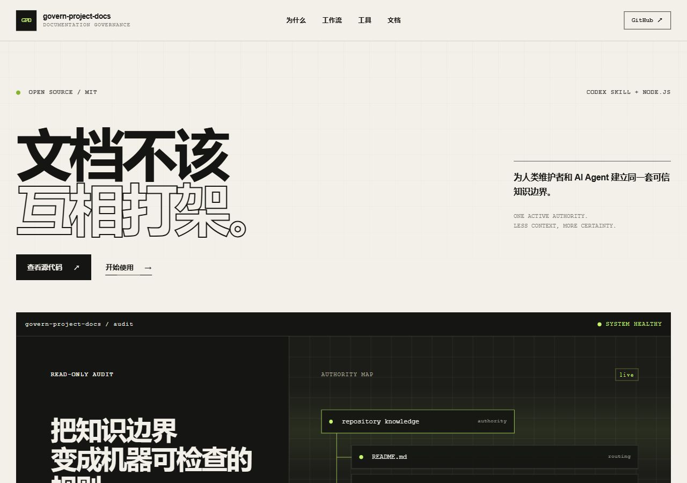

# govern-project-docs

[](https://github.com/CH-ZHOU-0512/govern-project-docs/actions/workflows/validate.yml)
[](https://ch-zhou-0512.github.io/govern-project-docs/)
[](LICENSE)

A Codex Skill and zero-dependency Node.js toolkit for keeping repository documentation authoritative, searchable, and economical for humans and AI agents to read.

这是一个面向大型项目和 AI 高频迭代仓库的文档治理工具包：审计重复或冲突的知识，建立清晰的权威来源与归档边界，并用确定性索引和 CI 检查防止文档体系再次失控。

[](https://ch-zhou-0512.github.io/govern-project-docs/)

<p align="center">
  <a href="https://ch-zhou-0512.github.io/govern-project-docs/"><strong>在线体验 →</strong></a>
  ·
  <a href="https://github.com/CH-ZHOU-0512/govern-project-docs"><strong>查看源码</strong></a>
</p>

## Why this project

Repository documentation usually becomes difficult to trust for the same reasons:

- the same changing fact is maintained in several active documents;
- completed plans and current status are mixed together;
- API, schema, and dependency facts are copied out of machine contracts;
- AI agents must read too much context before finding the relevant source;
- generated indexes exist, but nobody checks whether they are stale.

`govern-project-docs` applies five practical rules:

1. Give every changing fact one active authority.
2. Retrieve progressively: routing first, details on demand, evidence last.
3. Archive superseded evidence instead of silently deleting it.
4. Keep API, event, database, and dependency truth in machine-readable contracts.
5. Generate indexes deterministically and enforce freshness in CI.

## What is included

- [SKILL.md](SKILL.md) — the Codex workflow for auditing and reorganizing repository documentation.
- [scripts/audit-docs.mjs](scripts/audit-docs.mjs) — a read-only audit that finds documentation structure, duplication signals, missing metadata, broken local links, and stale path references.
- [assets/runtime](assets/runtime) — zero-dependency CLIs for authority enforcement, document indexing, bounded search, governance checks, and Markdown link validation.
- [assets/templates](assets/templates) — adaptable governance policies, AI change records, configuration, and JSON Schema starters.
- [references](references) — focused guidance for migrations, authority design, automation, CI, hooks, and stack-specific code graphs.

## Quick start

### Install as a Codex Skill

Clone the repository into your Codex skills directory.

PowerShell:

```powershell
git clone https://github.com/CH-ZHOU-0512/govern-project-docs.git (Join-Path $env:USERPROFILE ".codex\skills\govern-project-docs")
```

macOS or Linux:

```bash
git clone https://github.com/CH-ZHOU-0512/govern-project-docs.git "${CODEX_HOME:-$HOME/.codex}/skills/govern-project-docs"
```

Then ask Codex to use `$govern-project-docs`, for example:

```text
使用 $govern-project-docs 审计当前仓库的文档，先只给出权威来源、重复内容和归档建议，不修改文件。
```

### Run a read-only audit

Node.js 22 or 24 is recommended. No package installation is required.

```bash
node scripts/audit-docs.mjs --repo /path/to/target-repository
node scripts/audit-docs.mjs --repo /path/to/target-repository --json
```

The audit is intentionally read-only. It reports findings without reorganizing the target repository.

## Authority Engine

Schema v2 makes “one active authority” machine-checkable. Each governed document receives a stable ID and may claim narrow authority keys:

```yaml
---
doc-id: DOC-PAYMENTS-ARCHITECTURE
status: active
owner: payments-team
last-reviewed: 2026-08-03
authority-for:
  - payments.architecture
  - payments.retry-policy
---
```

The governance check rejects duplicate document IDs, multiple accepted or active documents claiming the same authority key, invalid authority keys, archived authority claims, unknown supersession targets, non-reciprocal replacements, and supersession cycles. Schema v1 configurations remain supported for incremental adoption.

When replacing a document, declare both sides of the relationship:

```yaml
# New authority
doc-id: DOC-PAYMENTS-V2
status: active
supersedes: [DOC-PAYMENTS-V1]

# Previous authority
doc-id: DOC-PAYMENTS-V1
status: superseded
superseded-by: DOC-PAYMENTS-V2
```

## Install the automation in another repository

Copy the following runtime files as a unit because the three CLIs import `docs-toolkit.mjs`:

```text
assets/runtime/docs-toolkit.mjs
assets/runtime/document-index.mjs
assets/runtime/check-doc-governance.mjs
assets/runtime/check-markdown-links.mjs
```

Copy and adapt the configuration templates only when the target repository does not already have an equivalent policy:

```text
assets/templates/docs-governance.config.json
assets/templates/docs-governance.schema.json
```

Example commands after installing the files under `scripts/`:

```bash
node scripts/document-index.mjs generate
node scripts/document-index.mjs check
node scripts/document-index.mjs query payments
node scripts/document-index.mjs watch
node scripts/check-doc-governance.mjs
node scripts/check-markdown-links.mjs
```

`watch` is local developer feedback. Deterministic generation plus CI freshness checks remain the shared correctness boundary.

## Repository layout

```text
.
├── SKILL.md                 # Codex workflow and operating rules
├── agents/openai.yaml       # Skill display metadata
├── scripts/                 # Read-only repository audit
├── assets/runtime/          # Reusable documentation CLIs
├── assets/templates/        # Policies, config, schema, record templates
├── references/              # Migration and automation guidance
└── tests/                   # Cross-platform Node.js tests
```

## Validation

Run the same local checks used by CI:

```bash
node --check scripts/audit-docs.mjs
node --check assets/runtime/docs-toolkit.mjs
node --check assets/runtime/document-index.mjs
node --check assets/runtime/check-doc-governance.mjs
node --check assets/runtime/check-markdown-links.mjs
node --test tests/*.test.mjs
node scripts/audit-docs.mjs --repo .
node assets/runtime/check-markdown-links.mjs --repo .
```

GitHub Actions validates Node.js 22 and 24 on both Ubuntu and Windows.

## Documentation

The [project Wiki](https://github.com/CH-ZHOU-0512/govern-project-docs/wiki) contains the longer-form guides:

- getting started and adoption paths;
- governance model, taxonomy, authority, and lifecycle;
- runtime CLI and configuration reference;
- development, validation, CI, and contribution guidance.

For a concise Chinese introduction, see the [LINUX DO / V2EX launch post](community/launch-post.md).

## Contributing

Issues and pull requests are welcome. Please keep changes deterministic, preserve cross-platform behavior, and include tests when modifying runtime tools. For a new governance rule, explain which failure mode it prevents and whether it belongs in human policy, configuration, or a machine check.

## License

Released under the [MIT License](LICENSE).
